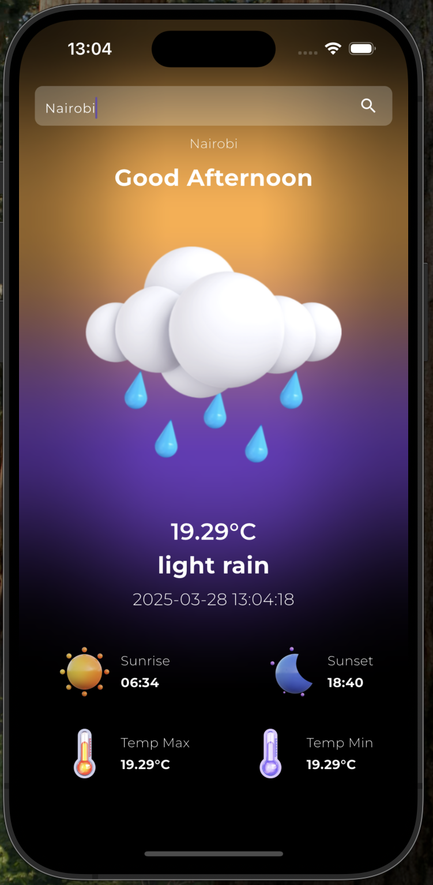
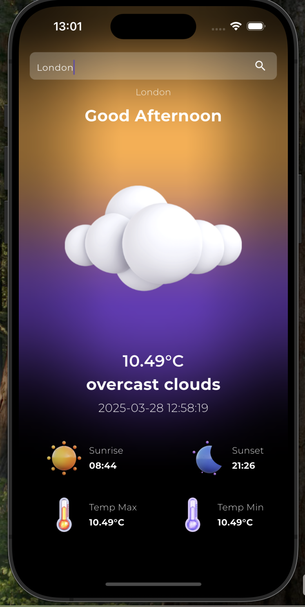
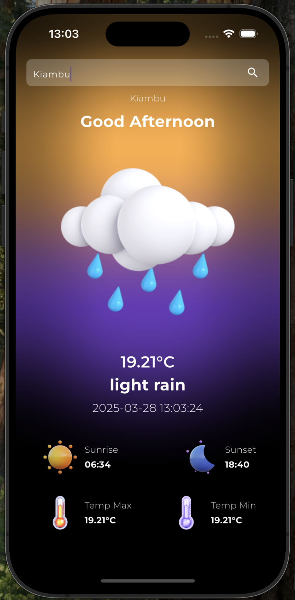

# Weather Now 🌤️

Weather Now is a Flutter-based weather application that provides real-time weather updates for cities around the world. The app allows users to search for weather information by city name and automatically loads the last searched city's weather when the app is reopened.

Now containerized with **Docker** for consistent builds and portable development environments. 🐳


---

## Features 🚀

- 🌍 **Search Weather by City**: Enter a city name to fetch its current weather details.
- 📍 **Last City Persistence**: Automatically loads the weather of the last searched city when the app starts.
- 🎨 **Beautiful UI**: A clean and modern user interface inspired by Apple's weather app.
- 📡 **Real-Time Weather Data**: Fetches weather data from the OpenWeather API.
- 🔄 **Smooth Animations**: Includes animations for the search bar and other UI elements.

---

## Screenshots 📸

| Home Screen | Cities |
|-------------|------------|
|  |  | 

---

## Getting Started 🛠️

Follow these steps to set up and run the app on your local machine:

### Prerequisites

- Flutter SDK: [Install Flutter](https://docs.flutter.dev/get-started/install)
- OpenWeather API Key: [Get your API key](https://openweathermap.org/api)


## Docker Support 🐳

Weather Now supports containerized development using Docker.

### Build the Docker Image

```bash
docker build -t weather_now .
```

### Run inside a container

```bash 
docker run -it --rm weather_now /bin/bash
```
Inside the container you can run
```bash
flutter --version
flutter analyze
flutter test
flutter build apk --debug
git status
```

### Installation

1. Clone the repository:
   ```bash
   git clone https://github.com/your-username/weather_now.git
   cd weather_now
   ```

2. Install dependencies 
```bash
flutter pub get
```

3. Create a .env file in the root directory and add your OpenWeather API key:

```
API_KEY=your_openweather_api_key
BASE_URL=https://api.openweathermap.org/data/2.5
```

4. Run the app 

```bash
flutter run
```

### Dependencies
The app uses the following Flutter packages:

flutter_bloc: State management.
dio: HTTP client for API calls.
shared_preferences: Local storage for caching the last searched city.
google_fonts: Custom fonts for a modern UI.
flutter_dotenv: Environment variable management.

### API Integration

The app integrates with the OpenWeather API to fetch real-time weather data. The following endpoints are used:

Current Weather Data:
```bash
GET /weather?q={city_name}&appid={API_KEY}&units=metric
```

### How It Works ⚙️

1. Search for a City:
Enter a city name in the search bar to fetch its weather data.
The app sends a request to the OpenWeather API and displays the results.

2. Last City Persistence:
The app saves the last searched city using shared_preferences.
When the app is reopened, it automatically fetches the weather for the last searched city.

3.Animated Search Bar:
The search bar is hidden by default and animates into view when the search icon is clicked

### Folder Structure 📂
 ```bash
 lib/
├── core/
│   ├── helpers/
│   │   └── cache_helper.dart  # Handles shared preferences
│   └── services/
│       └── api_service.dart   # Handles API calls
├── home/
│   ├── cubit/
│   │   ├── weather_cubit.dart # State management logic
│   │   └── weather_state.dart # Weather states
│   ├── models/
│   │   └── weather_model.dart # Weather data model
│   ├── repository/
│   │   └── weather_repository.dart # Repository for API calls
│   └── ui/
│       └── home_screen.dart   # Main UI screen
```

### Future Enhancements 🌟

 🌐 Geolocation Support: Automatically fetch weather data for the user's current location.

📅 7-Day Forecast: Display a weekly weather forecast.

🌙 Dark Mode: Add a toggle for light and dark themes.

📊 Weather Insights: Show additional weather details like wind speed, humidity, and pressure.

### Contributing 🤝
Contributions are welcome! If you'd like to contribute, please follow these steps:

1. Fork the repository.
2. Create a new branch:

```bash
git checkout -b feature/your-feature-name
```

3. Commit your changes 
```bash
git commit -m "Add your message here"
```

4.Push to the branch
```bash
git push origin feature/your-feature-name
```
5. Open a pull request

### License 📄
This project is licensed under the MIT License. See the LICENSE file for details.

### Ackmnowledgements

OpenWeather API for providing weather data.

Flutter community for their amazing resources and support.


### Contact

For any inquiries or feedback feel free to reach out

Email: gregorykago@gmail.com

Github: GregoDs

---
Thank you for using Weather Now! 🌦️


